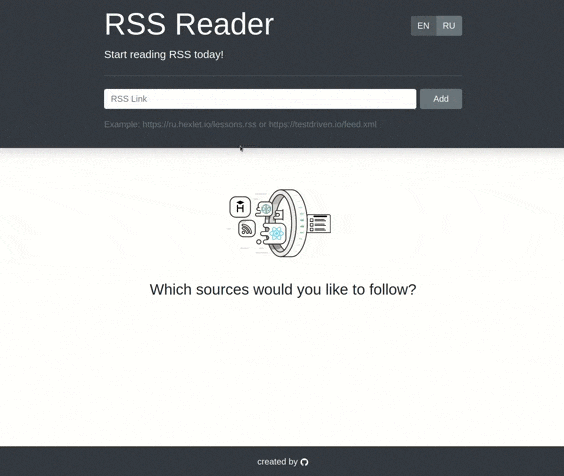

# RSS Reader

[](https://github.com/alexSmkh/rss-reader/actions)
[](https://codeclimate.com/github/alexSmkh/rss-reader/maintainability)


## Setup

```sh
make install
```

## Run

```sh
make develop
```

## Sample

